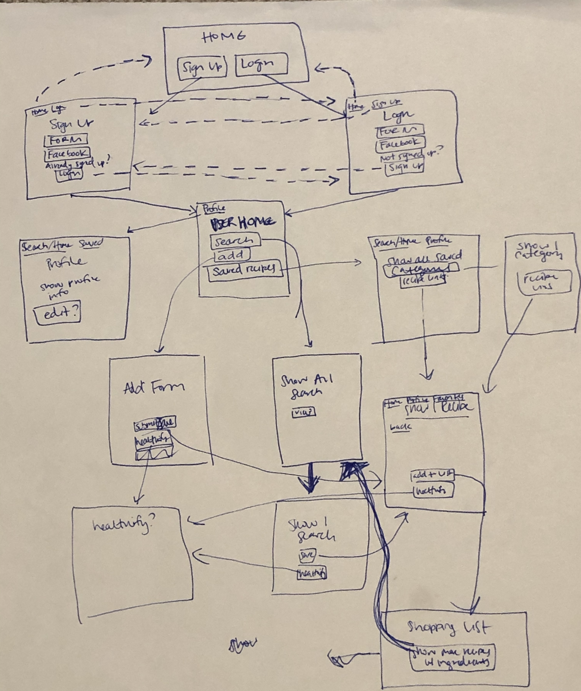

# Express Chef

## ABOUT
Express Chef is an app for the modern chef. Search for and save recipes to your digital cookbook.

Click [HERE](https://cooking-kennan.herokuapp.com/) for deployed app.

### User Profile

The chef express user wants:
* A resource to easily search and find recipes from a variety of sources, and save in one central location
* The ability to categorize recipes, and delete them if they don’t like them
* The option to pull in recipes from other sites and save them in the same place
* Help planning their meals for the week, and help finding recipes that have commonalities in order to make the most of their shopping list.

## HOW IT WORKS
1. Sign up with your email, or login via Facebook
> Note: FB functionality not working on deployed app due to pending Facebook approval
2. Search recipes (by ingredients or keywords) and view list of top results
4. Click to view the full recipe details of any recipe
5. Save recipes to "cookbook"
6. Uniquely categorize saved recipes
7. View all saved recipes or by category
8. Add a recipe by pasting any recipe url into the app

## TECHNOLOGIES USED
* Application - Node.js, Express, EJS, Express EJS layouts, CSS/Bootstrap, HTML, JavaScript
* Data - PostgreSQL, Sequelize
* Authentication - Passport
* API calls - Axios
* Deployment - heroku

## APPROACH
1. Created wireframes, UX flow & User Stories

2. Brainstormed Models and Routes

### Final Routes
| Method | Path | Location | Purpose |
| ------ | --------------- | -------------- | ----------------- |
| GET | / | index.js | dynamic home page (user logged in vs. not) |
| GET | * | index.js | Render error page |
| GET | /auth/login | auth.js | Login form |
| GET | /auth/signup | auth.js | Signup form |
| POST | /auth/login | auth.js | Logs in user |
| POST | /auth/signup | auth.js | Creates user & logs in |
| GET | /auth/logout | auth.js | Removes session info |
| GET | /profile | profile.js | User profile |
| GET | /profile/main | profile.js | User homepage |
| GET | /recipes/search | recipes.js | Search page |
| GET | /recipes/search/results | recipes.js | Show search results |
| GET | /recipes/search/result | recipes.js | Show more detail on one search result |
| GET | /recipes/add | recipes.js | Search for new recipe to add |
| GET | /recipes/add/result | recipes.js | Show more detail on one result from searching recipe to add |
| POST | /recipes | recipes.js | Save a recipe to cookbook |
| GET | /recipes | recipes.js | Show all saved recipes |
| GET | /recipes/:id | recipes.js | Show one saved recipe |
| DELETE | /recipes/:id | recipes.js | Delete one saved recipe |
| GET | /categories | categories.js | Show all User Categories |
| GET | /categories/:id | categories.js | Show One User Category with List of Recipes |
| PUT | /categories/:id | categories.js | Edit Category |
| DELETE | /categories/:id | categories.js | Delete Category |
| DELETE | /categories/:id/remrec | categories.js | Remove Recipe from Category |

### Final Models

#### User Model

| Column Name | Data Type | Notes | 
| ---------------- | ------------- | ----------------------------- |
| id | Integer | Serial Primary Key |
| firstname | String | Required |
| lastname | String | - |
| email | String | Must be unique / used for login |
| password | String | Stored as a hash |
| photoURL | String | Profile Picture |
| createdAt | Date | Auto-generated |
| updatedAt | Date | Auto-generated |

#### Category Model
| Column Name | Data Type | Notes | 
| ---------------- | ------------- | ----------------------------- |
| id | Integer | Serial Primary Key |
| name | String | - |
| userId | Integer | Foreign Key |
| createdAt | Date | Auto-generated |
| updatedAt | Date | Auto-generated |

#### Recipe Model
| Column Name | Data Type | Notes | 
| ---------------- | ------------- | ----------------------------- |
| id | Integer | Serial Primary Key |
| title | text | - |
| source | text | name of recipe source |
| sourceUrl | text | - |
| imageUrl | text | - |
| time | integer | total cook & prep time |
| servings | integer | - |
| ingredientsObj | JSONB | JSON array of objects (1 object per ingredient) |
| instructionsText | text | instructions as 1 block of text |
| instructionsObj | JSONB | JSON array of objects (1 object per step) |
| dishTypes | JSONB | array |
| healthLabels | JSONB | array |
| calories | integer | - |
| createdAt | Date | Auto-generated |
| updatedAt | Date | Auto-generated |

#### Associations
| Models | Relationship |
| ---------------- | --------- | 
| User : Category | 1 : M |
| User : Recipe | M : M |
| Recipe : Category | M : M |

3. Built out routes, ejs pages, and styled

## FUTURE FUNCTIONALITY HOPES
* Form to add full recipe from scratch
* Shopping list - add ingredients and search other recipes from the list to help with meal planning
* “healthify” - create new versions of recipes, subbing ingredients for healthier ones
* Edit fields of extracted recipe from outside sources for cases where it can't pull the recipe info in